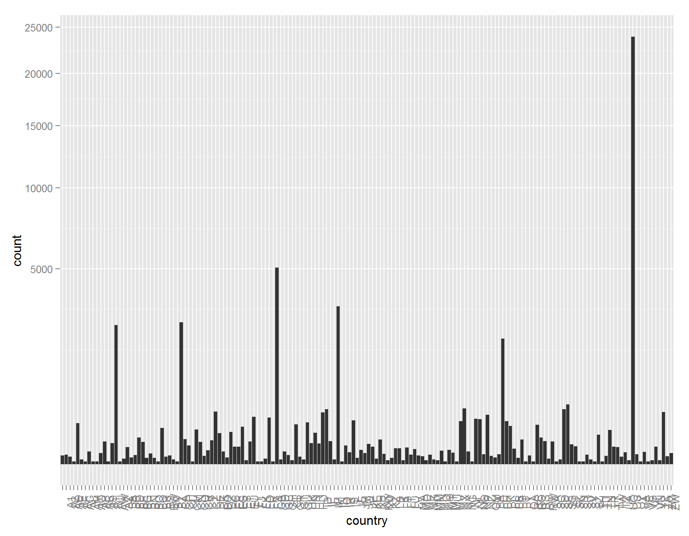
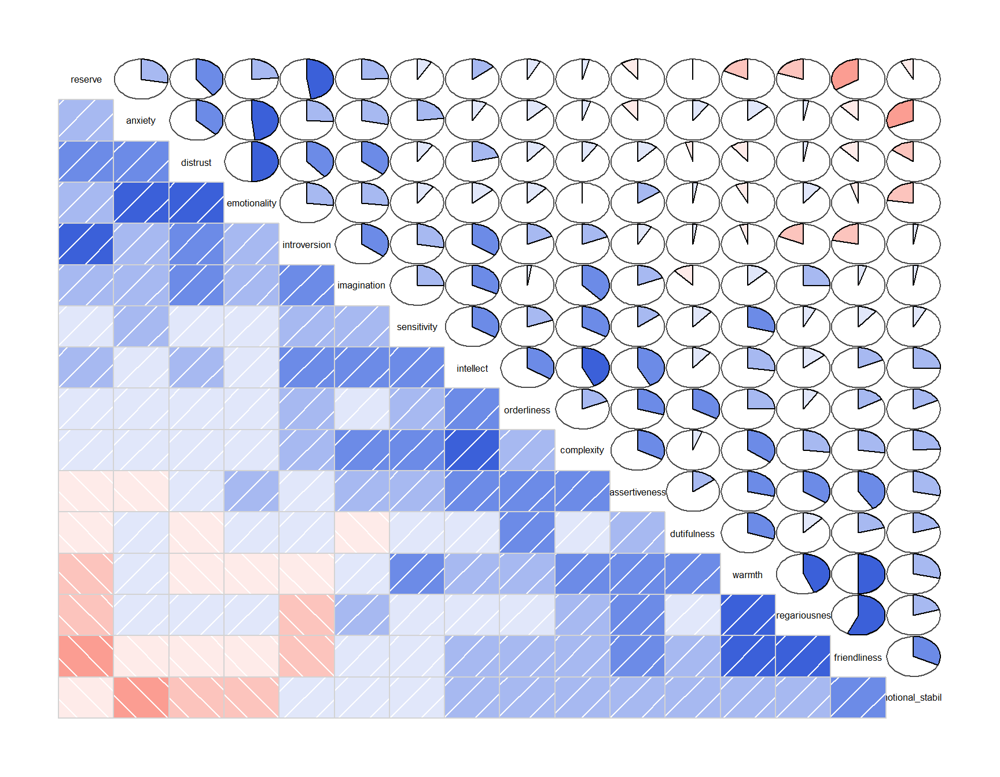
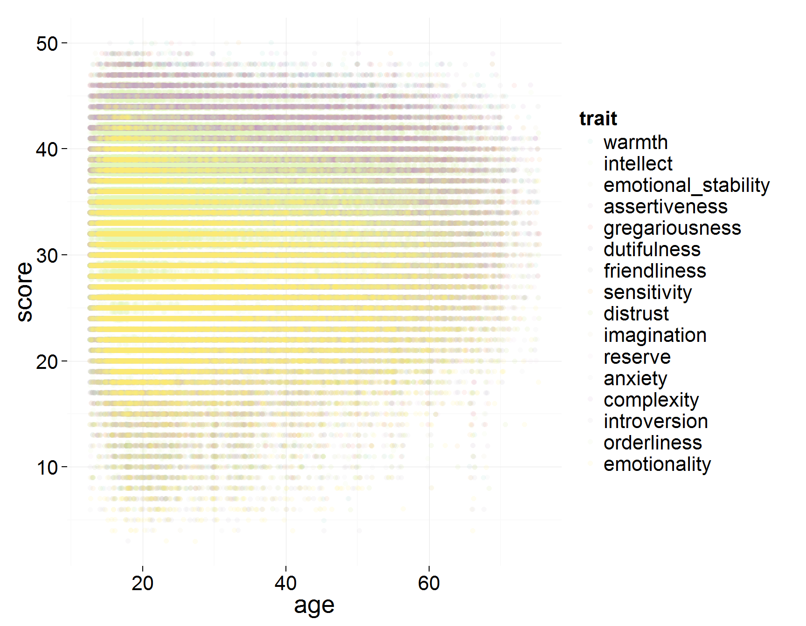
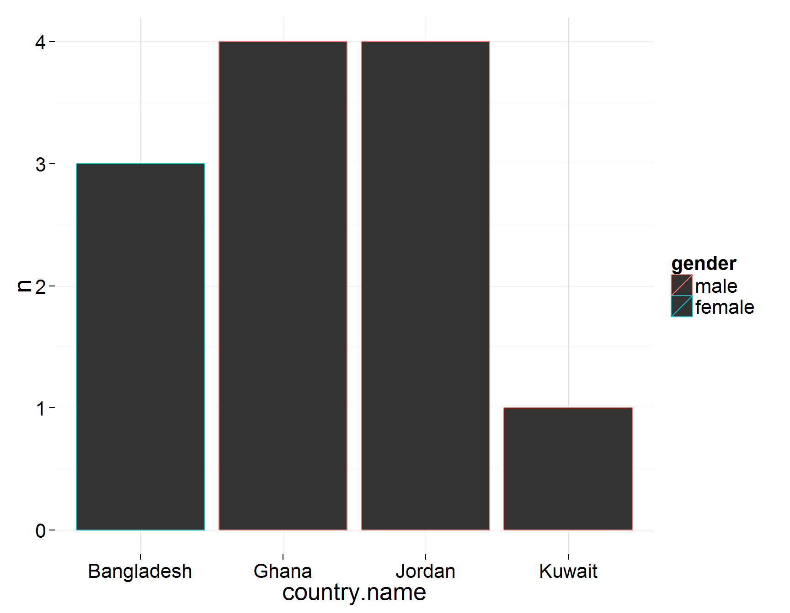

Personality Test Data EDA (Project 3) by Kaan Divringi
========================================================

```{r echo=FALSE, message=FALSE, warning=FALSE, packages}
# Load all of the packages that you end up using
# in your analysis in this code chunk.

# Notice that the parameter "echo" was set to FALSE for this code chunk.
# This prevents the code from displaying in the knitted HTML output.
# You should set echo=FALSE for all code chunks in your file.

library(ggplot2)
library(plyr)
library(dplyr)
library(tidyr)
library(gridExtra)
library(GGally)
library(maps)
library(countrycode)
library(RColorBrewer)
library(corrgram)
```

# Preamble

The data comes from a publicly available list of datasets on personality tests [link](http://personality-testing.info/_rawdata/). This dataset contains answers to a questionnaire designed to rate 16 different personality factors [Cattell's 16 Personality Factors](http://en.wikipedia.org/wiki/16PF_Questionnaire). It includes answers to 163 questions on a 1-5 integer scale (1 - disagree, 5 - agree). There is also information on age, gender, location, self-rated accuracy of answers and time taken in test. For more detail, please see the codebook included with this analysis.

```{r echo=FALSE, Load_the_Data}
# Load the Data
df <- read.csv('data.csv', sep="\t")
df <- na.omit(df)
```

### Scoring the Test
In addition to the raw question answers, the 16 personality traits will also be calculated and added, according to the scoresheet at [link](http://ipip.ori.org/new16PFKey.htm) and the methodology at [link](http://ipip.ori.org/newScoringInstructions.htm)

```{r}
# The positive indicator questions for the trait just get their integer value
# added to the score.
# For questions that negatively correlate with the trait, reverse the order
# of the integer values (5 = 1, 4 = 2, etc...)
neg <- c(5, 4, 3, 2, 1)
options(warn=-1)
df$warmth <- with(df, A1 + A2 + A3 +A4 + A5 + A6 + A7 +
                 neg[A8] + neg[A9] + neg[A10])

df$intellect <- with(df, B1+ B2 + B3 + B4 + B5 + B6 + B7 + B8 +
                       neg[B9] + neg[B10] + neg[B11] + neg[B12] + neg[B13])

df$emotional_stability <- with(df, C1 + C2 + C3 + C4 + C5 +
                        neg[C6] + neg[C7] + neg[C8] + neg[C9] + neg[C10])

df$assertiveness <- with(df, D1 + D2 + D3 + D4 + D5 + D6 +
                         neg[D7] + neg[D8] + neg[D9] + neg[D10])

df$gregariousness <- with(df, E1 + E2 + E3 + E4 + E5 + E6 +
                            neg[E7] + neg[E8] + neg[E9] + neg[E10])

df$dutifulness <- with(df, F1 + F2 + F3 + F4 + F5 +
                         neg[F6] + neg[F7] + neg[F8] + neg[F9] + neg[F10])

df$friendliness <- with(df, G1 + G2 + G3 + G4 +G5 +
                          neg[G6] + neg[G7] + neg[G8] + neg[G9] + neg[G10])

df$sensitivity <- with(df, H1 + H2 + H3 + H4 + H5 + H6 +
                         neg[H7] + neg[H8] + neg[H9] + neg[H10])

df$distrust <- with(df, I1 + I2 + I3 + I4 + I5 + I6 +
                      neg[I7] + neg[I8] + neg[I9] + neg[I10])

df$imagination <- with(df, J1 + J2 + J3 + J4 + J5 + J6 + J7 +
                         neg[J8] + neg[J9] + neg[J10])

df$reserve <- with(df, K1 + K2 + K3 + K4 + K5 +
                      neg[K6] + neg[K7] + neg[K8] + neg[K9] + neg[K10])

df$anxiety <- with(df, L1 + L2 + L3 + L4 + L5 + L6 + L7 +
                     neg[L8] + neg[L9] + neg[L10])

df$complexity <- with(df, M1 + M2 + M3 + M4 + M5 +
                        neg[M6] + neg[M7] + neg[M8] + neg[M9] + neg[M10])

df$introversion <- with(df, N1 + N2 + N3 + N4 + N5 + N6 + N7 + 
                          neg[N8] + neg[N9] + neg[N10])

df$orderliness <- with(df, O1 + O2 + O3 + O4 + O5 +
                         neg[O6] + neg[O7] + neg[O8] + neg[O9] + neg[O10])

df$emotionality <- with(df, P1 + P2 + P3 + P4 + P5 + P6 + P7 +
                          neg[P8] + neg[P9] + neg[P10])
options(warn=0)
```

#Univariate Plots & Analysis

### Demographic Data
Before looking at the initial personality questions, we can take a look at the demographic data(age, gender, accuracy, country, source, elapsed) to see what we have. The source and gender variables are integer columns that could be better represented as factor variables. After making the necessary adjustments, we can perform a summary of the variables of interest. Right away we can see that we have an issue with the age variable

```{r}
df$source <- factor(df$source, 
                   labels = c("frontpage", "google", "facebook", 
                              "edu", "wikipedia", "other"))
df$gender <- factor(df$gender, labels = c("unspecified", "male", 
                               "female", "other"))
summary(df[seq(164,169)])
```

The maximum age is 2.147 billion years old? The third quartile is 30. It looks like there are some extreme outliers in the data. Looking at the data, it seems we even have ages in the thousands and more than a 100. We can look at a histogram plot to get a better sense of the distribution, with modifications to the scale.

```{r}
ggplot(subset(df, age <= 150), aes(age)) + 
  geom_histogram(binwidth=1) + 
  scale_y_sqrt() + scale_x_continuous(breaks=seq(10,150,5))
```


From this graph it looks like there are some groupings of ages and that the continuous distribution of ages ends at about 75 years old. We'll look at the data from that age range or lower only.

```{r}
ggplot(subset(df, age <= 75), aes(age)) + 
  geom_histogram(binwidth=1) + 
  scale_y_sqrt() + scale_x_continuous(breaks=seq(10,75,5))
df <- subset(df, age <= 75)
summary(df$age)
```


We can see that although the mean age is 25, the median is significantly lower than that, indicating that the data is skewed towards lower ages. We can notice a large peak centered at 17 years of age. This distribution seems to suggest that high school students were a major chunk of those who took the exam. It may have been given as a standard test for career or counseling purposes.

The other major issue from the demographic variables was the outlier in the elapsed time, 8.5 million seconds. It seems unlikely that it took someone nearly 100 days to finish this exam! It seems that the median time to complete the exam is 754 seconds, which is 12.5 minutes but the mean time is 2510, nearly 42 minutes. 

```{r}
ggplot(df, aes(elapsed)) + 
  geom_histogram() + 
  scale_x_log10() + scale_y_sqrt()
```


This was an online survey, so perhaps the conditions were not carefully controlled (somebody may have started it, left it up for a long amount of time and then finished it later) or there could be a software bug (javascript not supported or peculiarities by browser). We can shed a bit of light on this by seeing the distribution by source.

```{r}
ggplot(df, aes(source, elapsed/60)) + 
  geom_jitter(alpha = 0.1) + 
  scale_y_log10() + ylab("Minutes")
```


The greatest outlier in the data is from the "other" category, which means that the source was not provided (possibly indicating privacy settings that interfered with the script) or another source not categorized. Given the online nature of the data, it does not seem appropriate to filter anything at this time.

The gender and country distributions are both more interesting with other data and will be looked at subsequently. Briefly we can see that the vast majority of the responses were from the US and that that respondents were more often female than male in a 3:2 ratio.

### Raw Questions

There are 16 different personality traits with 10 questions each, except for intellect which has 13 questions. Each question is marked on the same scale, 1-5, with 1 indicating a strongly disagree and a 5 indicating a strongly agree. What are the distributions of each of these questions? We can start by looking at the questions related to warmth.

```{r}
# Instead of repetively plotting column names, collect question names into
# it's own variable. This increases the amount of rows by a factor of 163.
df_byq <- gather(df,"question", "score", 1:163) # Creates a HUGE dataframe

ggplot(data = subset(df_byq, question %in% paste("A", 1:10, sep="")), 
       aes(x = score)) + 
  geom_freqpoly(aes(color = question), binwidth = 1) + 
  scale_color_brewer(type="div") +
  labs(title="Warmth Indicator Questions Score Distributions")
```


In the frequency polygon we can see a clear partition between the first 7 questions and the last 3. Looking at the scoring, we can see that the first 7 questions improve the warmth score whereas the last 3 decrease the warmth score. It would seem that warmth would be a desirable trait and people self-rated accordingly. What about for a possibly negative trait, distrust? The questions for this personality trait are keyed to the M factor.

```{r}
ggplot(data = subset(df_byq, question %in% paste("M", 1:10, sep="")), 
       aes(x = score)) + 
  geom_freqpoly(aes(color = question), binwidth = 1) + 
  scale_color_brewer(type="div") +
  labs(title="Distrust Indicator Questions Score Distributions")
```


Interestingly, distrust shows the same trend. The positive indicators for the feature are rated more favorably while the negative are rated unfavorably. We can look at this for each question and see if there any particularly popular or unpopular questions

```{r}
# Calculate means for each question
df_byq.means <- df_byq %>%
  group_by(question) %>%
  summarise(mean_score = mean(score),
            n = n()) %>%
  arrange(mean_score)

p1 = ggplot(subset(df_byq.means, mean_score > quantile(mean_score, 0.9)), 
            aes(question, mean_score)) + 
  geom_bar(stat="identity")
p2 = ggplot(subset(df_byq.means, mean_score < quantile(mean_score, 0.1)), 
            aes(question, mean_score)) + 
  geom_bar(stat="identity")
grid.arrange(p1, p2)

summary(df_byq.means$mean_score)
```


It looks like the top two most agreed with questions were "I use my brain" and "I enjoy hearing new ideas" while the two most disagreed were "I have a poor vocabulary" and "I dislike works of fiction." From the content of the questions, they seem to invite people to make value judgments about themselves and, unsurprisingly, they tend to paint themselves in a better light.

### Personality Traits

The raw questions are almost categorical data, in that they can only be one of 5 integers for an answer. Due to this, their distributions are relatively uninteresting. When we score up the question answers into the final 16 character traits, however, we get more conventional distributions.

```{r}
# Similar to the questions above, gather traits columns into a single column
# This time the dataframe isn't as large because we discard the raw questions
trait_cols <- names(df)[170:185]
df_traits <- gather(df[trait_cols], "trait", "score", 1:16)

ggplot(df_traits, aes(x = score)) + 
  geom_freqpoly(binwidth=1) + 
  facet_wrap(~trait)

by(df_traits$score, df_traits$trait, summary)
```


Each of the 16 traits seem to be normally distributed. There was no log scaling of the axes necessary. Some of them do seem to have a greater central tendency and there is also skew exhibited one way or another in several of them. We can get a better sense of how these characteristics stack up against each other from comparing via boxplots

```{r}
ggplot(df_traits, aes(x = trait, y = score)) + 
  geom_boxplot() + 
  theme(axis.text.x=element_text(angle=90))
```


This plot is slightly deceiving, however, due to the Intellect trait having 13 questions. Assuming a neutral answer of 3 for all thirteen questions, the average score is 39 as opposed to 30 for the other scores. We can normalize, replot and see what we have.

```{r}
summary(df$intellect)
#Reduce the intellect score proportionally, recreate the df_traits dataframe
df$intellect <- df$intellect*(10/13)
summary(df$intellect)
df_traits <- gather(df[trait_cols], "trait", "score", 1:16)

ggplot(df_traits, aes(x = trait, y = score)) + 
  geom_boxplot() + 
  theme(axis.text.x=element_text(angle=90))
```


Intellect is now not the most positively scored trait, it is now just one of the 3 most popular ones, with the average score coming down by approximately 11. We can see that complexity (openness to change) and warmth approach it as well. The most unpopular trait is emotionality, also called tension according to the supporting material, and many of the questions for it are fairly negative ("I get irritated easily", "I am quick to judge others", "I can't stand being contradicted"). Also low scoring traits are distrust(vigilance) and reserve(privateness).

### Country

One last thing we can take a look at are the countries in the dataset.

```{r}
summary(df$country)
```

There are 160 countries in ISO 3166 country codes that are based off of IP address. Due to this last fact, there are two augmentations to reflect unusual connection types: A1 for Anonymous Proxy and A2 for Satellite Provider.

```{r}
ggplot(df, aes(country)) + 
  geom_histogram() + 
  scale_y_sqrt() +
  theme(axis.text.x=element_text(angle=90))
```


Maybe on a map would be better.

```{r}
#Convert country codes to user friendly names that can be used by map_data
df$country.name<-countrycode(factor(df$country), "iso2c", "country.name")
#Need to change a few big countries so that they match with map_data
df$country.name<-revalue(df$country.name, c("United States"="USA",
                           "Russian Federation"="USSR",
                           "United Kingdom"="UK"))
#Create a dataframe of country names by count
df_bycountry <- df %>%
  group_by(country.name) %>%
  summarise(n = n()) %>%
  arrange(desc(n))
#Create a world map dataframe
wmap <- map_data("world")
#Merge the country names into the world map dataframe
wmap <- merge(wmap, df_bycountry, by.x = "region", by.y = "country.name", 
              all.x = TRUE)
wmap <- wmap[order(wmap$order), ]

ggplot() + geom_polygon(data=wmap, aes(long, lat, group=group, fill=n)) +
  scale_fill_continuous(trans = "sqrt")
```


That is a bit more helpful. The vast majority of the replies are from the United States, with Canada, Britain, Australia and India distant runner ups. There are a variety of other countries that have fairly low reply rates and others that did not reply or that I did not map the country names to. This map will be used again later.

### Rubric Questions
**What is the structure of your dataset?**
The data is composed of 49,152 respondents to a test of personality traits. The data includes the raw answers to the questions (integer scale of 1-5) and demographic data of age, gender, country, referral source for website, time taken to complete test and a self-rated accuracy scale.

**What is/are the main feature(s) of interest in your dataset?**
The main features of interest are the answers to the test questions to evaluate personality traits, which is the main objective of the dataset.

**What other features in the dataset do you think will help support your investigation into your feature(s) of interest?**
The demographic data of age, gender and country should be useful in investigating the effect of these on the output personality traits.

**Did you create any new variables from existing variables in the dataset?**
In the preamble, I scored the 163 raw test question answers into the corresponding 16 traits. The evaluated traits are the main topics of investigation in this analysis.

**Of the features you investigated, were there any unusual distributions? Did you perform any operations on the data to tidy, adjust, or change the form of the data? If so, why did you do this?**
In the age feature, there were some highly unusual values, including several dozen respondents with an age in the many hundreds and in some cases more than a thousand. In the course we encountered something similar in the Facebook data and I took a similar approach of cutting off the age values to a number in the 70s. I discarded data with a value larger than that.

One item of note in the age distribution was that a large number of respondents were teenagers, relative to the other ages.

I also tidied up the gender and source columns, which were initially columns of integers, into factor columns with appropriate factors corresponding to the integer values.

Throughout the bi and multivariate analysis I did change the form of the data many times in order to avoid repetitive coding for plots and analysis. This is discussed as it happens in this document. In all of these cases, however, the resulting transformed dataframes were copies of the original.

# Bivariate Analysis

### Correlations Between Traits
One common criticism of personality tests is that the indicators can be correlated to each other and may not be an expressive description of a given personality, if not flawed in other ways. We can look at the correlation between the 16 traits fairly quickly.

```{r}
corrgram(df[trait_cols], upper.panel = panel.pie, order=TRUE)
```


In this plot of correlations we can see a few expected relations. The most popular trait, intellect, correlates positively with another popular trait, complexity. We also see emotionality, the least popular trait, correlating positively with another trait of low popularity, distrust. There are some other positive correlations that appear on the test, such as friendliness and gregariousness, friendliness and warmth, emotionality and anxiety and finally introversion and reserve. We can take a closer look at a lower number of parameters with a more detailed plot.

```{r}
traits_of_interest = c('intellect', 'complexity','emotionality','distrust',
                       'friendliness','gregariousness','warmth','anxiety')
theme_set(theme_minimal(20))
ggpairs(df[traits_of_interest], lower=list(continuous = "density"), 
        axisLabels="none")
```


We can see some of the correlated data effects in how skewed the probability density contours look. This cross section of features is nice because it has the detail of the facet plot without the unreadability of all 16 traits. It also shows both highly correlated and uncorrelated variables. From this plot it does seem that some of the traits can be considered to overlap but not to a very large degree (<0.7 correlation coefficient).

### Traits By Gender
Another thing to consider that almost seems cliche to do, is to compare trait distributions between men and women (the sexes of Other and Not Defined will not be considered yet due to the low amount of data). The following plot would likely have been a nice resource for stand-up comedians a few decades ago.

```{r}
#Recreate the data frame with trait as a column with the demographic data added
trait_demo_cols <- names(df)[164:186]
df_traits <- gather(df[trait_demo_cols], "trait", "score", 7:22)

ggplot(subset(df_traits, gender %in% c("male", "female")), 
              aes(x = trait, y = score, color = gender)) + 
  geom_boxplot() + 
  theme(axis.text.x=element_text(angle=90))

by(df_traits$score, df_traits[c("gender", "trait")], summary)
```


It looks like the largest qualitative difference in traits between the male and female sexes are sensitivity and anxiety. There is a slighter difference in warmth, which favors females, and intellect, which favors males. This highlights another perceived problem in personality tests which is that they can test for people's impression of themselves rather than than some innate quality. The biases from this boxplot are quite stereotypical and may reflect perceived masculine and feminine traits from societal conditioning. For something a bit less stereotypical, we can go ahead and add the "other" gender category. If anything, it may give us something we don't expect.

```{r}
fp1 <- ggplot(subset(df_traits, gender %in% c("male", "female", "other")), 
       aes(x = trait, y = score, color = gender)) + 
  geom_boxplot() + 
  theme(axis.text.x=element_text(angle=90))
fp1
```


The rated personality traits of the "other" category are both different and a little sad. There is a marked decrease in warmth, dutifulness, friendliness and emotional stability. There is also increased imagination, distrust and introversion. These traits don't evoke gender stereotypes, they invoke another stereotype altogether: depression.

### Traits by Age

How to traits vary by age? That is something we can look at fairly quickly, albeit in a chaotic way. 

```{r}
# Do what I can to expand the color palette
getPalette = colorRampPalette(brewer.pal(12, "Set3"))

ggplot(df_traits, aes(age, score, color = trait)) + 
  geom_jitter(alpha = 0.1) +
  scale_color_manual(values = getPalette(16))
```



Plotting all of the points for each of the 16 traits looks like abstract art, so the best approach would be to facet it out by the individual traits.

```{r}
ggplot(df_traits, aes(age, score)) + 
  geom_point(alpha = 0.1) + 
  facet_wrap(~trait)
```


Here we can actually see some trends in some of the traits. From this and a plot of the means by age of each trait, we can see some qualitative trends.

```{r}
ggplot(df_traits, aes(age, score)) + 
  ylab("Mean Score") +
  geom_line(aes(color = trait), stat = "summary", fun.y = mean)
```


Interesting. This plot shows that some of the traits have an overall positive or negative trend as age increases. Emotionality and anxiety have a downward trend and dutifulness and complexity go up. There is also a lot of chaos or noise at the higher end. I wonder if perhaps the age cutoff should have been lowered even more.

The interaction between the trait scores and the age are one the numerical relationships that are available to us. Much of the other data, such as country or gender, is categorical. Let see the quantitative relationship between the various traits and age by calculating the correlation coefficients.

```{r}
cor(df$age,df[trait_cols])
```

The largest correlation was -0.2298 for imagination. Not a very strong trend.

### Traits by Country
One last thing we can look at are the traits by country. Is one country more warm or distrustful than another? We will only consider countries with 10 or more test takers, leaving us 91 countries. Since countries is a non-numerical way to compare. We cannot rely on correlations and will have to look at trends by groupings. Additionally, since the score of a trait does not mean much on it's own, we will calculate the z score of the mean of each country, per trait, in relation to the global mean and standard deviation of each trait.

```{r}

# Only countries with 10 or more
valid_countries <- subset(df_bycountry, n > 10)$country.name

# Group by countries, first calculating the mean of each trait within each country
df_bytraitcountry <- subset(df_traits, country.name %in% valid_countries) %>%
  group_by(country.name, trait) %>%
  summarise(mean = mean(score),
                 n=n()) %>%
  ungroup()

# Calculate means and sd's of each trait across all respondants
df_traitsinfo <- df_traits %>%
  group_by(trait) %>%
  summarise(global_mean = mean(score),
            global_sd = sd(score))

# Merge and calculate z score
df_bytraitcountry <- merge(df_bytraitcountry, df_traitsinfo, by="trait")
df_bytraitcountry$z <- (df_bytraitcountry$mean - 
                    df_bytraitcountry$global_mean)/df_bytraitcountry$global_sd

head(df_bytraitcountry[order(df_bytraitcountry$z),])
tail(df_bytraitcountry[order(df_bytraitcountry$z),])
```


It looks like Ukraine is particularly less warm, gregariousness and emotional! These self evaluations don't paint it as a particularly friendly country. Additionally, Nepal scores as particularly low on the intellectual trait. On the other end, Kuwait shows up as high on the introversion, distrust and reserve traits. Let's take a quick look at how the traits vary in z scores overall before looking  more closely.

```{r}
ggplot(df_bytraitcountry, aes(trait, z, color = n)) + 
  geom_jitter() + 
  theme(axis.text.x=element_text(angle=90)) + 
  scale_color_continuous(trans = "log10")
```


From this plot I was trying to see if there was a correlation between the smaller sample sizes and the extreme z values. While the larger sample sizes are generally closer to the mean, there are some that get more than half a standard deviation away. All the outliers are on the smaller end of the sample size, however.

We can get a clearer picture of how the trait distributions in countries vary with a boxplot.

```{r echo=FALSE, Multivariate_Plots}
ggplot(df_bytraitcountry, aes(trait, z)) + 
  geom_boxplot() + 
  theme(axis.text.x=element_text(angle=90))

by(df_bytraitcountry$z, df_bytraitcountry$trait, summary)
```


From here we can see a that the different traits vary by country quite differently. Some only have outliers in a single direction, like with warmth, intellect, sensitivity, anxiety and complexity only having low outliers while reserve is the only one with only high outliers. It is also interesting to observe the skew of the various traits. Warmth, for instance, has a global mean that is not even in the interquartile range of the countries evaluated. The same with gregariousness. This likely indicates that the low outlier countries have relatively small numbers of respondents. 

The dutifulness trait is unique in that it has a large interquartile range variation and no outliers at all. This probably means that it will be an interesting trait to plot on our world map.

```{r}
wmap <- map_data("world")
#Merge the country names into the world map dataframe
wmap <- merge(wmap, subset(df_bytraitcountry, trait == "dutifulness"), 
              by.x = "region", by.y = "country.name", all.x = TRUE)
wmap <- wmap[order(wmap$order), ]

fp2 <- ggplot() + geom_polygon(data=wmap, aes(long, lat, group=group, fill=z)) + 
  labs(title="Dutifulness Z-score By Country") + 
  scale_fill_distiller(type="div", palette="RdYlBu")
fp2
```


This map gives a good overview on dutifulness by country. We can see that Russia and Brazil test as particularly undutiful while Pakistan and Sri Lanka test as the most dutiful. The US and China are generally neutral while many of the European countries test low for dutifulness and the African countries test high. In South America there is some interesting diversity. These trends probably correspond with cultural issues that I am not knowledgeable on but it is  interesting to see the variation like this.

###Rubric Questions

**Talk about some of the relationships you observed in this part of the investigation. How did the feature(s) of interest vary with other features in the dataset?**
In some of the personality traits there were relationships, which are undesirable in my understanding. Traits that sound similar, such as friendliness, gregariousness and warmth were correlated. Other relations are emotionality/anxiety, intellect/complexity and emotionality/distrust and introversion/reserve. This could be problematic if these personality traits are intended to be used as inputs to predict something else. 

**Did you observe any interesting relationships between the other features (not the main feature(s) of interest)?**
There was some other interesting variation in the traits by country. Dutifulness, in particular, varied interestingly in what seemed like regional ways. Age and gender generally had a low correlation with various traits except for some stereotypical variation in terms of gender. The "Other" sexual category had some marked variation in some of the traits compared to the other genders.

**What was the strongest relationship you found?**
Some of the strongest relationships were between some of the evaluated personality traits! This likely indicates that some of the traits are either redundant, not well defined or poorly tested for. Traits varied much less by age or gender.

# Multivariate Analysis
### Traits By Gender And Country
We looked at traits by gender and traits by country but how do traits vary by traits and country? We saw the trait variation by gender exhibit some stereotypical properties. From this we can hypothesize that culture plays a factor in the test results. How does this vary country to country in terms of gender?

Before getting started, sectioning by gender reduces our sample size by half so w should make sure that we have a good mix of genders in the countries of interest.

```{r}
# This grouped data frame will group by country, gender and traits, otherwise
# similar to above
df_bytraitcountrygender <- subset(df_traits, country.name %in% valid_countries& 
                                    gender %in% c("male", "female")) %>%
  group_by(country.name, gender, trait) %>%
  summarise(mean = mean(score),
            n = n()) %>%
  ungroup() %>%
  ungroup()

ggplot(subset(df_bytraitcountrygender, trait == "warmth"), 
       aes(x = country.name, y = n, color = gender)) + 
  geom_bar(stat = 'identity') + scale_y_sqrt() + 
  coord_cartesian(ylim=c(0,1000))
```


Sure enough, we have some countries on the low end. Setting our cutoff at less than 5 respondents per gender, we can get a few countries to eliminate.

```{r}
ggplot(subset(df_bytraitcountrygender, n < 5 & trait == "warmth"), 
       aes(x = country.name, y = n, color = gender)) + 
  geom_bar(stat = 'identity')

bad_countries <- unique(subset(df_bytraitcountrygender, n < 5)$country.name)
df_bytraitcountrygender <- subset(df_bytraitcountrygender, 
                                  !country.name %in% bad_countries)
```


Also one last check to make sure we have no "missing values" in terms of gender respondents in a country.

```{r}
length(unique(df_bytraitcountrygender$country.name)) == 
  length(df_bytraitcountrygender$n)/ 16/ 2
```

Now we can calculate not quite a z-score but something analogous to an effect size to quantify the difference in the male and female populations per trait, per country. After that we add up the the total effect size over all traits per country to get a single number to compare across countries.

```{r}
# For plotting we have to expand the gender column (groups?) into one male 
# column and one female column, getting them both on the same row. We also have
# to remove the n column or it gets messed up
df_bytraitcountrygender <- spread(df_bytraitcountrygender[,1:4], gender, mean)
# Calculate the mean difference
df_bytraitcountrygender <- mutate(df_bytraitcountrygender, 
                                  diff_mean = male- female)
# Merge into this dataframe the global mean and standard deviation per trait
df_bytraitcountrygender <- merge(df_bytraitcountrygender, 
                                 df_traitsinfo, by="trait")
# Calculate the z score
df_bytraitcountrygender <- mutate(df_bytraitcountrygender, 
                                  z = diff_mean / global_sd)

# Aggregate to the mean z score per country
df_genderdiff <- df_bytraitcountrygender %>%
  group_by(country.name) %>%
  summarise(z_sum_mean = sum(z)/16) %>% 
  arrange(z_sum_mean)

ggplot(df_genderdiff, aes(z_sum_mean)) + geom_histogram(binwidth=0.025)


summary(df_genderdiff$z_sum_mean)
sd(df_genderdiff$z_sum_mean)

```


It looks like the mean of the mean of the effect sizes is about -0.077 z. There is a central tendency around 0, which seems to indicate a general lack of difference in tested personality by gender by country. The standard deviation of this distribution is 0.21, which is already standardized in terms of global standard deviation! This is a very narrow normal distribution when compared to a standard normal distribution that would have a standard deviation of 1. There do seem to be some outliers, though. The positive vs negative values do not have any meaning but taking the absolute value of the differences exaggerates the variation. We can visualize this over our world map to see trends.

```{r}
wmap <- map_data("world")
#Merge the country names into the world map dataframe
wmap <- merge(wmap, df_genderdiff, 
              by.x = "region", by.y = "country.name", all.x = TRUE)
wmap <- wmap[order(wmap$order), ]

fp3 <- ggplot() + geom_polygon(data=wmap, aes(long, lat, group=group, 
                                              fill=z_sum_mean)) + 
  labs(title="Gender Average Difference in Z Score by Country") + 
  scale_fill_distiller(type="div", palette="PuOr")
fp3
```


Looking at this map, it is a bit difficult to see any obvious trends. There are just the outliers and there is everybody else. The countries with the largest differences are Nepal, Iran, El Salvador and Kenya. To a lesser degree Uruguay, Spain, Turkey, Jamaica, Latvia, Japan and Switzerland stand out. After these countries, everything else just seems to blend together.

Apart from the outliers, there are not too many clear trends and that could be a good thing. We did observe that the mean difference is quite small, in terms of effect size. It seems that for much of the world, gender differences in overall personality has mostly disappeared but in the countries where it still exists, it exists in a big way. This suggests something of a network effect on gender differences in a culture: the gender differences are either believed by a large amount of people or by much fewer. For most of the world, though, it is encouraging that gender differences don't seem to be very statistically significant in determining personality traits. 

One thing to note is that Georgia is not present in this map, which had the largest difference between the genders, with a value of -1.33. So the total variation is less than it could be in this map.

###Rubric Questions

**Talk about some of the relationships you observed in this part of the investigation. Were there features that strengthened each other in terms of looking at your feature(s) of interest?**
One of the things that was slightly surprising and encouraging to observe was the lack of strength of the gender feature affecting the other traits in country to country for the majority of countries. There were definitely several outliers but overall it seemed that most of the world has moved beyond those gender stereotypes. Compared to the variation in dutifulness explored earlier, it seemed that country was a stronger influence on trait variation than gender.

**Were there any interesting or surprising interactions between features?**
I found it interesting to see how dutifulness varied by country. For whatever reason this trait, alternatively named Rule-Consciousness, exhibited a wide range of variation by country, having the largest interquartile range. The map of the dutifulness rating shows a type of continuity by region across different countries that may indicate certain cultural elements. In Europe and Russia, for example, there is a supposed trend of non-conformity while India and Pakistan are both very conscientious. North America and China are much more the middle ground and South America is very diverse. I only wish I had some type of sociological background to be able to put this in some type of context.

**OPTIONAL: Did you create any models with your dataset? Discuss the strengths and limitations of your model.**
No models were created, as the data did not present much in the way of strong relationships with which to build them. There was also the issue of a fair amount of it being categorical data, as opposed to numerical. Since dummy variables in R were not covered in the class, it would have been another barrier to research and implement them for what seemed like not much benefit.

------

# Final Plots and Summary

### Plot One - Traits By Male/Female/Other
```{r echo=FALSE, Plot_One}
fp1 + labs(title="Trait Boxplots by Gender(Male/Female/Other)")
```


Looking at the traits by gender seemed to be one of the more obvious ways to include the demographic data. Having previously seen not much or not much interesting difference in the traits between Males and Females, I included the Other category in this plot. The difference between male and females in the evaluated traits seemed to either be slight or to follow cultural gender stereotypes (sensitivity). It was a different story for respondents with a sex of Other, a seemingly sad one of significantly lower warmth, friendliness and higher distrust.

### Plot Two - Dutifulness Around The World
```{r echo=FALSE, Plot_Two}
fp2
```


In looking at the variation of the traits across countries, the dutifulness had the widest variation in terms of interquartile range. To see the trends in the data, it was the obvious candidate for visualization on a map. Europe and Russia are the least dutiful while Southeast Asia and Africa are the most. China and North America are the middle ground while South America is very diverse. This trait, I think, reflects something in the respective cultures of these places that I cannot articulate.

### Plot Three - Gender Personality Difference Around The World
```{r echo=FALSE, Plot_Three}
fp3
```


To visualize the effect of two categorical demographic variables on 16 different continuous variables, I had to do some data acrobatics to get a mean difference in trait scores between gender, per country. The familiar map chart is the best way to visualize the large number of country categories in the dataset. The average personality difference from gender on a country to country basis seemed to be either an outlier or hardly significant at all. This plot shows the majority of countries in the survey showing little gender difference on overall personality while also showing those outliers where it does make a difference very clearly.

------

# Reflection
For the most part I found this dataset satisfyingly challenging to work with. The 16 different personality traits provided a good motivation to avoid programmatic busy work and I had to use the facilities of R to transform the data many times in order to efficiently plot and evaluate what I wanted to. I switched the traits from columns to rows several times and I made heavy use of the group_by functionality to perform the calculations that I wanted to.

One shortcoming, so to speak, of the dataset was that it all seemed to be inputs. The personality trait scores don't seem to be useful outputs alone and I think they are probably more interestingly used to predict various other things. In the confines of just this dataset there is not very much to predict. It would have been useful have, for example, performance/health/longitudinal data to go along with these personality evaluations. Then there would be more potential to use the data as a model of some sort to make predictions. Despite this, it was still interesting to look at how the demographic data related to the personality scores. 

Due to the test results being anonymized, it seems unlikely that there will be such data available to be joined to the existing data. If there is such data it would likely be for a subset of the respondants in this dataset. Regardless, I still think it would be an interesting analysis to try and use these personality indicators as inputs into something else.